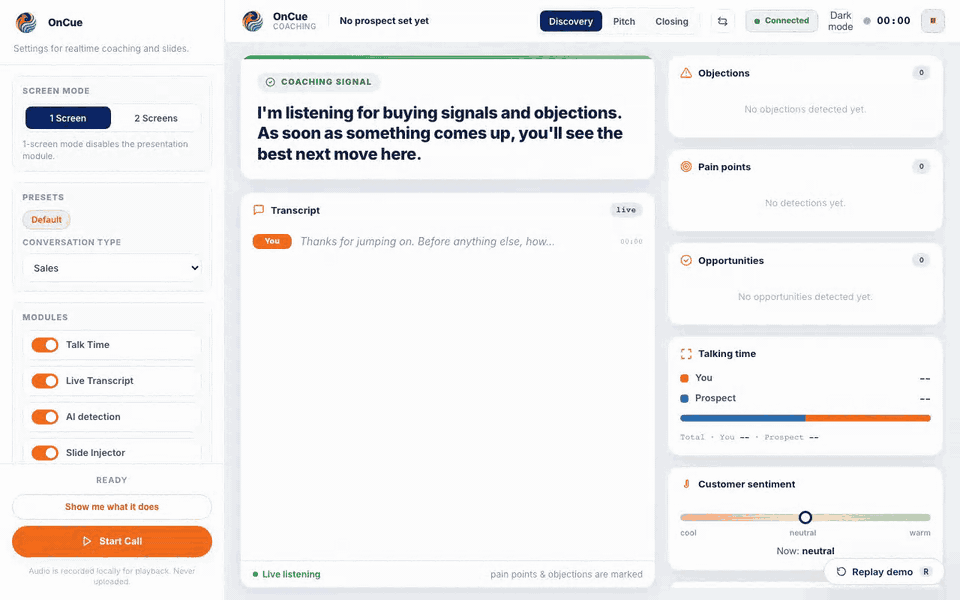
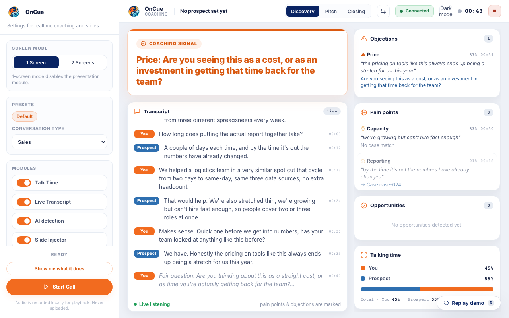

# OnCue

[](https://github.com/Vinix24/OnCue/actions)
[](LICENSE)
[](docs/BETA_TESTER_GUIDE.md)

An open-source, real-time sales copilot that runs during video calls. It transcribes the conversation, detects pain points, objections, and buying signals as they happen, and coaches talk-time balance on a second screen.

Privacy is the default, not an option you opt into. Audio capture, transcription, and pain-point detection all run on your machine. Nothing leaves it unless you explicitly configure a cloud LLM destination, and that choice is made per conversation, not locked in at install time.

---

## Demo



A scripted discovery call playing through the coaching dashboard: live transcript, pain points firing with a matched case slide, a monologue coaching alert with the talk-time split, a price objection with its counter-response suggestion, and a buying signal.

| Talk-time coaching | Objection detected |
|---|---|
|  |  |

---

## Three things worth knowing before you clone this

**1. Transcription and detection run on-device.**
Audio never touches a network call. Transcription runs locally through the `TranscriptionBackend` protocol, backed by [whisper.cpp](https://github.com/ggml-org/whisper.cpp) (the default, built by `scripts/install.sh`) or `mlx-whisper` as an experimental Apple Silicon fallback. Pain-point and objection detection runs through `semantic-router`, an embedding classifier that also stays local. The only thing that can leave the device is a short, PII-redacted transcript fragment, and only if you've configured a cloud LLM provider.

**2. Cloud, when you use it, can stay inside your own tenant.**
LLM routing is provider-agnostic through `src/sales_copilot/core/llm_client.py`, built on `instructor`. Point it at Ollama for zero external calls, or at your own Azure OpenAI subscription, your own Vertex AI project, or your own AWS Bedrock account. Fragments then stay inside a cloud boundary your organization already governs, under your existing contract and DPA, instead of adding a new processor. This is the difference between "we call an API" and "your data stays in your tenant." For regulated NL B2B specifically, that difference is what gets a tool through procurement.

**3. It works with any video-call platform, because it doesn't integrate with any of them.**
OnCue captures whole-system audio (AudioTee on macOS, WASAPI loopback on Windows) instead of talking to the Teams, Zoom, or Meet API. That means no bot joining the call, no per-platform integration to build or maintain, and no admin consent or calendar access to request. Meet, Zoom, Teams, Webex, or a phone bridge all look the same to the capture layer: system audio.

---

## Beyond sales

OnCue is built and positioned for sales calls first. The underlying pipeline, on-device transcription plus pain-point/objection/buying-signal detection plus talk-time coaching plus a post-call report, doesn't know it's a sales call. The same capability applies to other conversation types:

- **Coaching and performance reviews**: talk-time balance and pattern detection apply just as well to a manager-employee conversation as a sales call.
- **Job interviews / recruitment conversations**: detecting recurring themes and questions asked (or missed) works the same regardless of who's being evaluated.
- **Deep-dive / user-research interviews**: a live transcript plus a structured post-call report is useful for research synthesis, not just deal tracking.
- **1:1s and mentoring**: talk-time coaching (not dominating the conversation) is a skill independent of sales context.
- **Consulting discovery calls**: pain-point detection is the same mechanic whether the "prospect" is a sales lead or a consulting client.
- **Customer-success / support calls**: objection and sentiment detection transfer directly to a support or retention conversation.

Same capability, other conversation types. Nothing here changes today's sales-first defaults (`config/pain_points.yaml`, the sales preset, the case-slide library); building out a preset for a different conversation type is a matter of configuration, not a different pipeline.

---

## How it works

```
Audio (mic + system) ─▶ VAD (talk-time) ──────────────────────────▶ Coaching dashboard
                     ─▶ Transcription (whisper.cpp / mlx-whisper) ─▶ Detection (semantic-router)
                                                                       │
                                                          ┌────────────┴────────────┐
                                                          ▼                         ▼
                                                  Coaching dashboard      Reveal.js presentation
                                                  (your second screen)    (screen you share)
```

All components talk to each other over WebSocket on `localhost:8760`. Every module (audio capture, transcription, detection, the WebSocket hub) is independently runnable and testable. Full breakdown, including the BYO-tenant boundary and a component-level diagram: [docs/ARCHITECTURE.md](docs/ARCHITECTURE.md).

---

## Quickstart

Requires Python 3.11+. macOS is the primary, working platform; Windows support is experimental (WASAPI loopback, verified on physical hardware 2026-07-26, see [Platform support](#platform-support)).

```bash
git clone https://github.com/Vinix24/OnCue.git
cd OnCue
./scripts/setup.sh          # creates .venv, installs deps, builds AudioTee locally
cp .env.example .env        # then add at least one LLM API key, or point LLM_PROVIDER at ollama
python -m sales_copilot     # starts audio capture, transcription, detection, and the WebSocket hub
```

The coaching dashboard opens on `localhost:8760/dashboard`. Product language defaults to Dutch (`LANGUAGE=nl` in `.env.example`); English is a fully supported first-class toggle via `LANGUAGE=en`, independent of `CALL_LANGUAGE`, the spoken language passed to the transcriber.

Two other install paths exist for non-developer setups (a one-shot installer script and a packaged `.app`); see [INSTALL.md](INSTALL.md) for those and for provider setup, troubleshooting, and the full configuration reference ([docs/CONFIG.md](docs/CONFIG.md)).

---

## Privacy and cloud, as a spectrum

The choice of where an LLM fragment goes is made per conversation, not per install and not per customer. The same person can run one call fully local and route the next through a cloud LLM, depending on what that specific call allows.

| Tier | What it means | When to use it |
|---|---|---|
| **Local** | `LLM_PROVIDER=ollama`. Nothing leaves the machine, including LLM inference. | Default. Sensitive or regulated calls. |
| **BYO-tenant cloud** | Your own Azure OpenAI subscription, Vertex AI project, or AWS Bedrock account. Fragments stay inside a cloud boundary your organization already governs. | Regulated B2B where a new processor is a procurement blocker. |
| **Public cloud** | A public API (OpenAI, OpenRouter, Groq, Gemini). | Internal meetings, sales training, or any call where the sensitivity allows it. |

Local stays the default in every case; the cloud tiers exist to broaden what the tool can be used for, not to replace it. Enforcement detail: [docs/ARCHITECTURE_BOUNDARIES.md](docs/ARCHITECTURE_BOUNDARIES.md) (the invariants CI checks on every PR). Full AVG/GDPR and AI Act treatment: [docs/PRIVACY.md](docs/PRIVACY.md).

---

## What's inside

- **Live transcription**: whisper.cpp large-v3-turbo by default, locally, with speaker-side attribution.
- **Pain-point detection**: 12+ NL categories in `config/pain_points.yaml`, sliding-window multi-task classification.
- **Objection detection**: 5 categories (price, timing, competitor, scope, authority); the curated counter-response playbook is a Pro feature.
- **Talk-time coaching**: a breathing-bar indicator on your second screen, not a popup or alert, based on academic research on non-disruptive real-time feedback.
- **Post-call reports**: full transcript, pain points, objections, and talk-time stats as JSON and Markdown, written locally.
- **Vakgebied-presets**: the `sales` preset ships with the OSS app as a full pre-configured detection + compliance profile. The vertical starter-packs (`coach`, `recruitment`, `acquisitie`) are Pro content and ship with the Pro distribution; the OSS app fail-softs to `sales` when they are requested but absent. See [docs/PRESETS.md](docs/PRESETS.md).

Full feature matrix, including what's Pro versus Free: [docs/FEATURES.md](docs/FEATURES.md).

### Tech stack

Python 3.11+ backend, FastAPI + websockets for the hub, `instructor` + `semantic-router` for structured LLM output and detection, Silero VAD for talk-time, SQLite by default for sessions and the case database (Supabase optional), Reveal.js for the shared presentation, and a vanilla HTML/CSS/JS coaching dashboard with no build step.

---

## Platform support

**macOS** is primary and working. AudioTee's whole-system audio tap is the default capture path (no BlackHole routing needed); BlackHole remains available as a manual fallback.

**Windows** is experimental. WASAPI loopback capture (`src/sales_copilot/audio/wasapi.py`) is implemented and was verified in a Windows 11 VM with a real hardware-audio probe, then confirmed on physical Windows hardware 2026-07-26 (RTX 2050, cuBLAS transcription, live WASAPI capture). See [CONTRIBUTING.md](CONTRIBUTING.md#help-wanted--good-first-areas) if you want to be the first data point there.

Current pilot limitations and known issues: [KNOWN_ISSUES.md](KNOWN_ISSUES.md).

---

## Documentation

| Document | Covers |
|---|---|
| [docs/ARCHITECTURE.md](docs/ARCHITECTURE.md) | Full architecture: data plane, BYO-tenant boundary, component diagram |
| [docs/ARCHITECTURE_BOUNDARIES.md](docs/ARCHITECTURE_BOUNDARIES.md) | The invariants CI enforces (local-first, provider-agnostic, localhost-only, ...) |
| [docs/PRIVACY.md](docs/PRIVACY.md) | AVG/GDPR and AI Act treatment |
| [docs/CONFIG.md](docs/CONFIG.md) | Full `.env` configuration reference |
| [docs/PRESETS.md](docs/PRESETS.md) | Vakgebied-presets: sales, coach, recruitment |
| [docs/FEATURES.md](docs/FEATURES.md) | Free vs. Pro feature matrix |
| [docs/BENCHMARKS.md](docs/BENCHMARKS.md) | Local latency per pipeline stage, measured on real hardware |
| [docs/FAQ.md](docs/FAQ.md) | Common setup and usage questions |
| [docs/TROUBLESHOOTING.md](docs/TROUBLESHOOTING.md) | Diagnosing setup problems |
| [docs/INDEX.md](docs/INDEX.md) | Full documentation index |

---

## Testing

```bash
source .venv/bin/activate
python -m pytest tests/
```

CI runs the full suite on every PR (see the badge at the top of this file); test coverage spans the audio pipeline, transcription backends, the sliding-window detector, the LLM client across all supported providers, the license gate, the PII filter, and the WebSocket hub.

---

## License

The core is licensed under **AGPL-3.0** ([LICENSE](LICENSE)): anyone who distributes a modified version or runs it as a network service must publish their modifications under the same license. A [commercial license](LICENSE-COMMERCIAL.md) is available for organizations that cannot operate under AGPL terms. Pro and Enterprise features are proprietary extensions distributed separately under that commercial license; the free, self-hosted core in this repo is complete and fully functional on its own. Third-party attribution: [THIRD_PARTY_LICENSES.md](THIRD_PARTY_LICENSES.md).

## Contributing

Pull requests are welcome. Read [CONTRIBUTING.md](CONTRIBUTING.md) first. Contributors agree to [CLA.md](CLA.md); community conduct is governed by [CODE_OF_CONDUCT.md](CODE_OF_CONDUCT.md). For security disclosures, follow [SECURITY.md](SECURITY.md) instead of opening a public issue.

## Links

- Website: [oncueassistant.com](https://oncueassistant.com)
- Issues: [GitHub Issues](https://github.com/Vinix24/OnCue/issues)
- Contact: info@vincentvandeth.nl
