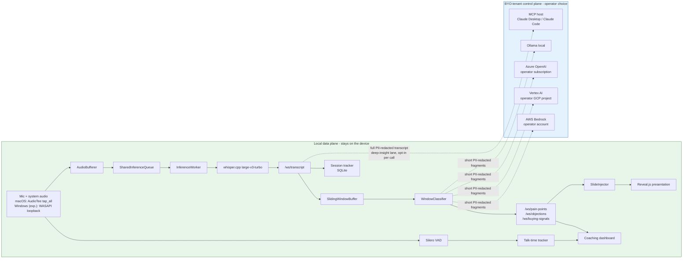
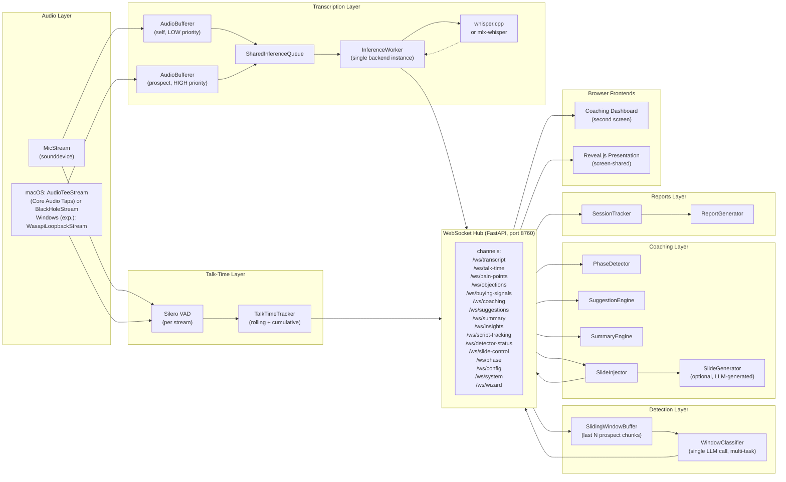

# Architecture: OnCue

This document describes the system architecture as of 2026-09-07 (v0.9.0: whole-system AudioTee `tap_all` default, replay capture, calltap + security fixes + Windows WASAPI capture, MCP bridge / deep-insight lane, report delivery sinks, three-mode wheel/`.app` resource resolution). It is the companion
to TTD (per-component API contracts and data models) and is the
recommended starting point for developers who want to understand how the pieces
fit together.

---

## Overview

OnCue is a locally-running Python backend with two browser frontends. All
components communicate over WebSocket on `localhost:8760`. No component can reach
another over the network without going through the hub.

### Data plane and BYO-tenant boundary



Audio, session recordings, embeddings, and the case database stay on the device. The default outbound class is short PII-redacted transcript fragments, and only to the LLM destination the operator configured.

There are two further outbound classes, and both are deliberate rather than exceptions. The deep-insight lane (track 3, Pro) sends the PII-redacted full session transcript, plus prep-docs, to a destination the operator opts into per conversation. That destination can be a BYO-tenant cloud, a public frontier API, or an MCP host connected through the MCP bridge described below. With the lane off, which is the default, nothing changes: only short fragments leave.

The third class is report delivery (added #218): OnCue is sold partly as a *trigger* — local capture and transcription, and when the call ends the finished report can additionally be handed to the customer's own automation, via an operator-configured directory (including a mounted network share) and/or an HTTP endpoint, both off by default. This class deliberately does **not** go through `core/outbound_policy.py` — its destination is never an LLM, it is infrastructure the customer owns, and the entire point is handing their own automation their own words verbatim. See "Reports layer" below and [ARCHITECTURE_BOUNDARIES.md](ARCHITECTURE_BOUNDARIES.md) ("Trigger delivery outbound class") for the full argument. The enforced version of the deep-insight-lane rule also lives there.

### Component diagram



---

## Product modes

OnCue supports two distinct operating modes. They share the same audio,
transcription, and detection stack; the difference is when output is delivered
and which pipeline runs.

### Live copilot (default)

All layers run concurrently during the call. The VAD, transcription, and
detection pipeline fires in real time; coaching alerts and slide injections
appear to the salesperson while the prospect is still speaking. End-to-end
latency from speech to slide-visible on screen is approximately 1.5–3.5 seconds.

This mode requires a machine with enough CPU/GPU headroom to run Whisper
transcription, an LLM classification call, and the WebSocket hub simultaneously.
Apple Silicon (M-series) with `whisper.cpp` covers the full stack without
dedicated GPU RAM allocation. Windows runs the same
`whisper.cpp` CPU path behind `WasapiLoopbackStream` instead of `AudioTeeStream`
— see [Audio layer](#audio-layer) for the capture-side differences.

### Post-processor

Audio is captured and recorded during the call; real-time coaching is disabled or
reduced to talk-time only (no detection, no slide injection). After the call ends,
the transcript and detection pipeline runs over the recorded WAV files at full
inference speed without real-time constraints. `ReportGenerator` triggers the
batch pipeline and produces a structured JSON/Markdown session report. This mode
is appropriate when the hardware budget, network context, or workflow makes
real-time inference impractical.

The `TRANSCRIBE_SELF_LIVE=false` default already uses a partial post-processor
model for self-speech: salesperson audio is transcribed in batch after the call
rather than queued alongside prospect speech during the call.

### BYO-tenant differentiator

Both modes support a bring-your-own-tenant LLM configuration: instead of routing
classification fragments to a third-party API (Gemini, Groq, OpenAI), the system
can point at an Azure OpenAI endpoint within the customer's own Azure subscription,
a Vertex AI project in their own GCP account, or AWS Bedrock in their own AWS
account. Audio capture and transcription remain local; the LLM inference happens
inside the customer's own cloud contract. This keeps processed transcript fragments
within the customer's existing data-processing boundary and DPA, which is the
relevant compliance framing for regulated NL B2B (financial services, healthcare,
HR). Configured via `LLM_PROVIDER` and the matching endpoint/key environment
variables in `.env`.

---

## Layer descriptions

### Audio layer

**Files:** `src/sales_copilot/audio/`

Two separate audio streams are captured simultaneously, both behind the shared
`AudioStream` protocol (`start`/`stop`/`read` plus `chunks_received` and
`device_label`) so the rest of the pipeline never branches on OS:

- `MicStream` captures the salesperson's microphone via `sounddevice` (16 kHz,
  mono, float32) on both macOS and Windows. Speaker attribution: `"self"`.
- **Prospect stream** — route options, selected via `AUDIO_CAPTURE_METHOD` and
  `PROSPECT_SOURCE` in `.env`:

| Route | Platform | `AUDIO_CAPTURE_METHOD` / `PROSPECT_SOURCE` | How it works | Use case |
|---|---|---|---|---|
| `AudioTeeStream` | macOS (default) | `AUDIO_CAPTURE_METHOD=audiotee` (default) + `PROSPECT_SOURCE=blackhole` (default, historical name — means "follow `AUDIO_CAPTURE_METHOD`") | Whole-system Core Audio process-tap (`tap_all=True`); excludes the telephony daemon (`avconferenced`) on the free tier via `TelephonyTapGuard` | Teams, Zoom, Meet — no manual audio routing |
| `BlackHoleStream` | macOS (fallback) | `AUDIO_CAPTURE_METHOD=blackhole` | Reads from the BlackHole virtual device (system audio mix). Manual fallback only — selected when you set `AUDIO_CAPTURE_METHOD=blackhole` explicitly (e.g. macOS <14.2, or if the AudioTee build is unavailable). Never auto-selected | Fallback for video calls (also macOS <14.2) |
| `CallTapStream` | macOS only (Pro) | `PROSPECT_SOURCE=audiotee_call` | Process-tap on `avconferenced` (the macOS telephony daemon) via AudioTee `--include-processes <pid>` — Sales Pro (`FEATURE_CALLTAP`) | iPhone-relay calls (Continuity), FaceTime audio |
| `WasapiLoopbackStream` | Windows (default) | `AUDIO_CAPTURE_METHOD=wasapi` | WASAPI loopback on the default render endpoint via `soundcard` (`sc.default_speaker()` → `sc.get_microphone(..., include_loopback=True)`) — whole-endpoint capture, same "no per-app targeting" property as `tap_all`. The recorder is a COM object bound to the thread that opens it, so a single reader thread owns its entire lifecycle (open, read, periodic re-attach, close) and explicitly joins the process COM apartment for its lifetime (#224) | Teams, Zoom, Meet on Windows |

**Platform normalization.** `DualAudioCapture.create()` (`capture.py`) is the
single authoritative point that resolves `AUDIO_CAPTURE_METHOD` and
`PROSPECT_SOURCE` for the current platform via `normalize_capture_method()` /
`resolve_prospect_source()`, even when a caller already passed a value meant
for the other OS. On Windows, the macOS-only methods (`audiotee`/`blackhole`)
normalize to `wasapi`; on macOS/Linux, `wasapi` normalizes to `audiotee`. A
mismatched value is corrected with a logged warning, not a raised error, so a
`.env` copied between a Mac and a Windows machine keeps working unedited.

**macOS telephony limitation:** Phone/iPhone-relay calls bypass all virtual audio devices
(BlackHole, Soundflower, etc.). The beller-audio travels through `avconferenced` directly,
never reaching the system output mix. This is a documented macOS constraint — not a
configuration error. Use `PROSPECT_SOURCE=audiotee_call` for telephony (requires macOS 14.2+).
A Bluetooth headset works fine in `audiotee_call` mode because the tap is on the process,
not the audio device. **On Windows this seam has no fix:** WASAPI whole-endpoint loopback
cannot follow a single process the way AudioTee's process-tap does, so an explicit
`PROSPECT_SOURCE=audiotee_call` on Windows normalizes back to `blackhole` instead of
raising, and `CallTapStream` is never constructed there — there is no way to isolate
telephony audio from the rest of the system mix on Windows. Whether the whole-endpoint
tap picks up telephony audio *at all* (the same principle `tap_all` uses on macOS,
since a relayed call played through the render endpoint is just more audio on that
endpoint) is a separate, open question: a 2026-09-07 field test confirmed the audio
reaches the Windows output pipeline, but confirming that `WasapiLoopbackStream` itself
catches it is still outstanding — see INSTALL.md's Windows section ("Telephony
capture") for the exact, dated evidence.

The `DualAudioCapture` factory in `capture.py` selects the implementation based
on `AUDIO_CAPTURE_METHOD` and `PROSPECT_SOURCE` in `.env`. `RecorderEngine`
(`recorder_engine.py`) wires streams independently for the recorder path: when
`capture_method == "wasapi"` it short-circuits straight to `WasapiLoopbackStream`
+ `MicStream` before any `TelephonyTapGuard` / process-lookup call, since `pgrep`
does not exist on Windows. One consequence of the short-circuit: the free-tier
telephony-exclusion guard is a no-op on Windows, because WASAPI whole-endpoint
loopback has no per-process exclusion to apply it to (operator-approved
position for the Windows track).

Sessions are recorded to `data/sessions/<id>/{mic,system}.wav` via
`AudioRecorder` (PR-97). Recording can be disabled with `RECORD_AUDIO=false`.

Replay testing uses `ReplayAudioStream` (`audio/replay.py`) as a drop-in
replacement for live capture. See [REPLAY_TESTING.md](REPLAY_TESTING.md).

### Transcription layer

**Files:** `src/sales_copilot/modules/transcriber/`

**Design:** [SHARED_INFERENCE_QUEUE_DESIGN.md](SHARED_INFERENCE_QUEUE_DESIGN.md)

A shared-queue architecture introduced in PR-102 replaces the earlier dual-engine
approach that caused concurrent Metal/MLX backend dispatches (SIGABRT). The three
main actors:

1. **AudioBufferer** (one per audio stream): runs the Silero VAD and RMS gate,
   accumulates speech frames, and pushes complete `InferenceQueueItem` values
   onto the shared queue. It does not hold a backend reference.

2. **SharedInferenceQueue**: bounded priority queue (default size 32). Prospect
   chunks get priority 0 (HIGH), self chunks get priority 1 (LOW). Within the
   same priority, older items surface first.

3. **InferenceWorker**: owns the single `TranscriptionBackend` instance and the
   single WebSocket connection to `/ws/transcript`. Pops the highest-priority
   item, calls `backend.transcribe(audio)`, applies the hallucination filter, and
   publishes a `TranscriptEvent`.

**Backends** (`backends/`):

| Backend | File | Hardware | Notes |
|---|---|---|---|
| `whisper.cpp` | `whisper_cpp_backend.py` | Any hardware | **Default** (`WHISPER_BACKEND=whisper.cpp`, see `.env.example`). Built by `scripts/install.sh` (`vendor/whisper.cpp/build/bin/whisper-cli`). Subprocess per chunk on temp WAV. Cross-platform, stable on macOS. |
| `mlx-whisper` | `mlx_backend.py` | Apple Silicon only | **Experimental fallback.** Apple Neural Engine acceleration. **Known issue:** the live-pad path may silently deliver zero segments (open item); if you hit silent transcription on Apple Silicon, switch back to `whisper.cpp`. `create_backend` auto-falls back here when the whisper.cpp binary is missing. |

The `TranscriptionBackend` Protocol (`backends/base.py`) defines the interface.
Adding a new backend means implementing four methods: `start`, `warmup`,
`transcribe`, `stop`.

All backends publish to the same `/ws/transcript` channel with the canonical
transcript event format. The wire format is unchanged regardless of backend.

Self-transcription (the salesperson's own speech) defaults to batch mode after
the call ends (`TRANSCRIBE_SELF_LIVE=false`). This keeps the inference queue
serving prospect speech without competing for the GPU during the call.

### Talk-time layer

**Files:** `src/sales_copilot/modules/talk_time/`

- `vad.py`: wraps Silero VAD. CPU-only, under 10 ms per frame. Two instances run
  in parallel, one per audio stream.
- `tracker.py`: `TalkTimeTracker` receives VAD speech events, maintains a circular
  buffer for rolling 2-minute windows, and computes cumulative percentages.
  Detects monologues (consecutive speech > 76 seconds) and emits `CoachingAlert`
  events.
- `publisher.py`: publishes `TalkTimeState` to `/ws/talk-time` (every 5 seconds)
  and `CoachingAlert` to `/ws/coaching` on threshold breach.

Phase targets are configurable: discovery (35% self), pitch (65% self), closing
(45% self). The dashboard phase toggle sends a `phase_change` event to
`/ws/config`.

### Detection layer

**Files:** `src/sales_copilot/modules/detector/`

The detector subscribes to `/ws/transcript` and processes only prospect speech
(`speaker = "prospect"`).

**Sliding-window architecture (PR-105):**

1. `SlidingWindowBuffer` (`sliding_window.py`): a deque of the last N
   `TranscriptChunk` objects (default `DETECTOR_WINDOW_SIZE=5`). Requires a
   minimum of `DETECTOR_MIN_CHUNKS=3` chunks before classifying.

2. `WindowClassifier` (`window_classifier.py`): makes a single LLM call per
   window that returns all detection types at once, using `instructor` for
   structured output:

   - `pain_point` (with subcategory from `config/pain_points.yaml`)
   - `objection` (with subcategory from `config/objections.yaml`)
   - `buying_signal`
   - `doubt`
   - `none`

   The system prompt is phase-aware (discovery / pitch / closing) and includes 10+
   negative examples to reduce false positives on backchanneling. This replaces
   the previous per-fragment embedding-similarity path.

3. `Debouncer` (`debouncer.py`): per-category cooldown (default `DEBOUNCE_SECONDS=45`).
   Re-classification is debounced at 5 seconds (`DETECTOR_DEBOUNCE_S`).

Detection results publish to `/ws/pain-points`, `/ws/objections`,
`/ws/buying-signals`, and `/ws/coaching` (for doubt events).

The consume loop also publishes its own per-reason counters to
`/ws/detector-status` (`status_publisher.py`), at a bounded cadence and carrying
counters and timestamps only. That channel is what lets the dashboard tell
"listening, nothing to report yet" from "something upstream is broken" without
reading a log; its payload is specified in `docs/TTD.md` section 7.

The semantic-router path (`router.py`) is not the default classification path,
but it is not dormant either: `WindowClassifier.classify()` is a no-op when no
LLM provider is configured, so on a provider-less install that router is what
produces pain-point detections. It runs a keyword fast path before the
embedding match; both are described in [MODULE3.md](MODULE3.md).

**What the detector says about itself.** The consume loop is instrumented at
DEBUG throughout, and `LOG_LEVEL` defaults to INFO, so for a long time a
detector that dropped every chunk and a detector that was never started looked
identical in the log. Since the observability round the loop also emits, at
INFO: a line on the first transcript chunk it receives, a bounded heartbeat
every `_HEARTBEAT_CHUNK_INTERVAL` chunks, and a closing summary when the loop
exits. The heartbeat and the summary carry per-reason counters — `received`,
`skipped_not_prospect`, `buffered_below_min`, `debounced`, `classified`,
`dropped_none`, `dropped_low_confidence`, `dispatched` — so "nothing is
happening" always resolves to a reason without raising the log level. No
transcript text is logged at INFO; content stays at DEBUG.

The orchestrator (`src/sales_copilot/__main__.py`) complements this at call
start: next to `Enabled modules` it logs `Disabled modules` with the source of
each disabled flag, and warns explicitly when the detector is off. An absence
in a list is not a signal a human notices.

LLM provider is configurable via `LLM_PROVIDER` in `.env` (Gemini — shipped
default, OpenRouter, Groq, OpenAI, Ollama, Vertex AI, Azure OpenAI). All LLM
calls go through `instructor` for structured output.

### Coaching layer

**Files:** `src/sales_copilot/modules/copilot/`, `src/sales_copilot/modules/detector/`

Several coaching sub-systems run alongside the main detection loop:

- `PhaseDetector` (`phase_detector.py`): LLM-based automatic phase classification
  (discovery / pitch / closing). Optional; dashboard manual phase toggle takes
  precedence.
- `SuggestionEngine` (`suggestions.py`): generates real-time follow-up questions
  based on recent transcript context. Publishes to `/ws/suggestions`.
- `SummaryEngine` (`summary.py`): produces a rolling 2-sentence summary every 60
  seconds plus a key-moments list. Publishes to `/ws/summary`.
- `SlideInjector` (`copilot/injector.py`): receives pain-point detections, matches
  them against the case database, and drives the shared presentation over
  `/ws/slide-control`. Gated behind the `presentation.dynamic_slides` feature —
  requires a Pro license. Free tier has no in-call presentation automation. The
  delivery mechanism is intentionally not documented here.
- `SlideGenerator` (`copilot/slide_generator.py`): LLM-based slide generation used
  within the Pro-gated injector path when no pre-authored case matches. Controlled
  by `DYNAMIC_SLIDES` in `.env`; has no effect without an active Pro license.

### Reports layer

**Files:** `src/sales_copilot/modules/reports/`

- `SessionTracker` (`session.py`): subscribes to all hub channels and accumulates
  call events (transcripts, pain points, objections, talk-time snapshots, phase
  transitions). Stores everything in memory during the call.
- `ReportGenerator` (`generator.py`): called at call end. Produces a JSON export
  and Markdown summary in `data/sessions/<id>/`. The post-call self-batch
  transcription step runs here if `TRANSCRIBE_SELF_LIVE=false`. The local write
  to `data/reports/` is unconditional and always happens first; it also carries
  `call_started_at`/`call_ended_at` (ISO-8601) so a downstream consumer can
  answer "when did this call happen".
- `delivery.py` (#218): two optional, independent, default-off sinks invoked
  right after the local write — a directory (`REPORT_DELIVERY_DIR`, atomic
  write so a directory-watcher never sees a partial file) and an HTTP endpoint
  (`REPORT_DELIVERY_ENDPOINT`, one `POST` with bounded retries). Both run on a
  background daemon thread so a slow or hung endpoint never delays shutdown.
  The delivered payload is byte-identical to the local report file. The HTTP
  endpoint sink is Pro/Enterprise-gated (`reports.delivery.endpoint`); on Free
  it is skipped with one `WARNING` per process and the directory sink still
  runs. See [MODULE4.md](MODULE4.md) ("Report Delivery") for the full contract.

Offline batch analysis is available via `scripts/label_and_summarize.py` (PR-108),
which runs a Gemini pipeline over a raw transcript to produce a structured summary
with speaker labels, wishes, and module recommendations.

### WebSocket hub

**Files:** `src/sales_copilot/websocket/`

The hub is a FastAPI application split across four modules:

- `hub_core.py`: channel registry and broadcast logic
- `hub_api.py`: REST endpoints (`/api/start-call`, `/api/end-call`, `/api/upload`,
  `/api/models`, `/api/presets`)
- `hub_upload.py`: context document upload handling
- `hub_static.py`: serves `dashboard/` and `presentation/` as static files

The main `hub.py` composes all four. All WebSocket channels bind to
`127.0.0.1:8760` only. The hub is not accessible from other machines on the
network by default.

### Dashboard and presentation

**Files:** `dashboard/`, `presentation/`

Both frontends are vanilla HTML/CSS/JS with no build step.

The **coaching dashboard** (`dashboard/index.html`) shows four panels: talk-time
breathing bar, detection log (pain points and objections), live transcript with
auto-scroll, and rolling summary. It connects to the hub over WebSocket and
renders updates in real-time. The dashboard also contains the pre-call setup
screen for configuring the call.

The **Reveal.js presentation** (`presentation/index.html`) is the screen the
salesperson shares with the prospect. Under a Pro license, the SlideInjector
advances it over `/ws/slide-control` as the conversation develops.

### Cross-cutting: Preset system

**Files:** `src/sales_copilot/core/preset.py`, `config/presets/`

Three named presets swap routes, UI labels, and LLM prompt addenda at startup:
`sales` (default), `coach`, `recruitment`. Selected via `PRESET=` env var or the
`/api/start-call` payload. See [PRESETS.md](PRESETS.md) for full spec.

### Cross-cutting: Client folders (klantmap)

**Files:** `src/sales_copilot/core/klant_config.py`,
`src/sales_copilot/core/privacy_gate.py`,
`src/sales_copilot/core/cloud_sync_warning.py`

A client folder under `KLANTEN_ROOT` (env override; falls back to
`context_docs.UPLOAD_ROOT`) may contain a `klant.yaml` naming the client's
company, industry, contact people, and glossary terms, plus an optional
`privacy` ceiling (`local`/`tenant`/`public`) and an optional `bewaren_dagen`
retention window. The dashboard's setup screen resolves a single client picker
(`/api/v1/clients`) instead of free-typed prospect fields; `hub_core.
extract_start_call_config` loads the selected client's `klant.yaml` to fill
`prospect_company`, `prospect_industry`, `call_terms`, and the privacy
ceiling. A client folder without `klant.yaml` keeps working exactly as before
(folder name as company, loose files as dossier).

- `klant_config.py`: schema, loader, and path safety for `klant.yaml`. A slug
  that resolves outside `KLANTEN_ROOT` (`..` segments, an absolute path, a
  symlink escape) is a hard error.
- `privacy_gate.py`: rejects `/api/start-call` with a 400 before any capture
  starts if the configured LLM provider does not meet the client's `privacy`
  ceiling. Uses the same `outbound_policy.tier_of()` classification as
  `PII_REDACTION`'s `cloud_only` mode, so the privacy gate and the PII policy
  can never disagree about what counts as local, tenant, or public.
- `cloud_sync_warning.py`: detects when `KLANTEN_ROOT` lives under iCloud
  Drive, `Library/CloudStorage` (Dropbox/OneDrive/Google Drive via the File
  Provider), Dropbox, or an iCloud-synced Desktop/Documents. Detect-only,
  never blocks — the setup screen surfaces the warning and the choice stays
  with the operator.

A client-linked call archives its transcript and report into
`<klantmap>/gesprekken/<datum>-<session_id>/` on call end (`core/retention.py`
and the reports runner). Retention runs two independent layers: the global
`DATA_RETENTION_DAYS` sweep, and a client's own `bewaren_dagen` window, which
fires even when the global sweep is disabled and is never capped by a shorter
global window. Purging a session (GDPR Art. 17) removes only that session's
own `gesprekken/` archive and its own auto-saved dossier transcript — never
another session's archive or a hand-curated dossier note.

These client-folder capabilities are part of the Free tier.

### Cross-cutting: Auth — license gate and feature entitlement

**Files:** `src/sales_copilot/auth/`

License authority is a Cloudflare Worker that issues Ed25519-signed keys with the
`SCP-` prefix. The 32-byte Ed25519 public key is embedded directly in
`license_verifier.py`; all signature verification happens fully offline — no
network call is required to verify a key. The private key lives exclusively on
the Worker and is never distributed.

**Key format.** An `SCP-` key encodes 91 bytes (version, tier, rotation epoch,
issued-at, expires-at, a 16-byte random `license_id`, and the 64-byte Ed25519
signature) as unpadded RFC 4648 base32 grouped every four characters. The
`license_id` is a 128-bit random value (32 hex chars); it contains no email,
name, or other personal data and is the only identifier sent in the revocation
phone-home.

**Rotation hook.** The key struct carries a `rotation_epoch` byte. When the
signing key rotates, the prior epoch's public key is registered under its epoch
byte, so old keys remain verifiable until they expire naturally.

**Legacy keys.** Keys with the `SC-` prefix (HMAC-SHA256, symmetric) are
accepted on a time-limited basis while the deployment migrates. After the
migration deadline 2026-09-01, `SC-` keys are rejected by the verifier. Issuance
of new `SC-` keys stopped at the time `SCP-` keys were introduced.

**Feature entitlement.** `FeaturePolicy` (`auth/feature_policy.py`) is the
single entitlement source. It calls `decode_and_verify`, checks revocation, and
maps the resolved tier to an explicit per-tier feature set via `allows(feature_id)`.
The full Free/Pro/Enterprise feature table is canonical in
LICENSE_PRO_CONTRACT.md
(source of truth: `license_format.py`).

`is_pro()` is a backward-compatibility wrapper for existing call sites; all new
feature checks should call `allows()` directly with the feature ID.

**Revocation phone-home.** At startup, `revocation_cache.py` checks whether the
active `license_id` has been revoked or expired by `POST`ing only
`{"license_id": "<32-hex-char-id>"}` to `https://license.salescopilot.app/license/check`
(configurable via `SALES_COPILOT_LICENSE_CHECK_URL`). The response returns
`{"revoked": bool, "expires_at": int}`. The result is cached for 7 days in
`~/.sales_copilot/revocation_cache.json`. On network failure the client falls
back to any prior cached value, and otherwise fails open within the grace window
— a revoked key can lag by at most ~7 days, by design (UX over hard lock). No
PII travels in either direction; see [PRIVACY.md](PRIVACY.md) for details.

For the full key byte layout and issuance API, see [LICENSE_KEY.md](LICENSE_KEY.md).

### Cross-cutting: Audit ledger and compliance audit

**Files:** `src/sales_copilot/core/audit_ledger.py`, `src/sales_copilot/core/compliance_audit.py`, `src/sales_copilot/core/consent.py`, `src/sales_copilot/core/retention.py`

`AuditWriter` (`audit_ledger.py`) is an append-only NDJSON log of every AI
decision involving personal data. It satisfies AI Act Annex III logging
requirements for the recruitment preset (high-risk classification). Recruitment
mode requires HMAC signing via `AUDIT_HMAC_SECRET` and fails closed when it is
missing. See [AUDIT_LEDGER.md](AUDIT_LEDGER.md).

`TieredAuditWriter` (`compliance_audit.py`) wraps `AuditWriter` and adds a Pro
tier: when the `compliance.central_audit` feature is entitled, it computes a
SHA-256 hash of each record client-side and ships only that hash to the
`/audit/ingest` endpoint on the license server. The raw record — including any
PII — never leaves the local machine. The central endpoint receives only the
hash and the license key (for authorization); it builds a tamper-evident chain
server-side. If the network call fails, the local write is unaffected. Free
tier: local SQLite only, no outbound call.

`consent.py` records a non-blocking per-session consent flag as an audit event.
It never prevents a call from starting. Enabled by default; disable with
`CONSENT_TRACKING_ENABLED=false`.

`retention.py` provides the policy layer for configurable session-data retention.
`DATA_RETENTION_DAYS` sets the window in days; `0` disables auto-purge. Actual
deletion runs via `scripts/retention_purge.py` (scheduled via cron).

### Optional: MCP bridge (Pro)

**Files:** `src/sales_copilot/mcp_bridge/`

The deep-insight lane can be driven by the operator's own MCP host instead of
by `core/llm_client.py`. The bridge is a standalone process
(`python -m sales_copilot.mcp_bridge`) that connects to a running hub as an
authenticated local WebSocket client and speaks MCP JSON-RPC over stdio to
whatever host launched it. It exposes three read tools (`get_session_brief`,
`get_transcript`, `get_detections`) and one write-back tool (`push_insight`)
that publishes onto the same insights channel the built-in engine uses, labeled
by origin so the operator always sees which reasoning path produced a row.

The two directions are not symmetric. Outbound, everything passes through
`core/outbound_policy.py` and is PII-redacted, because an MCP host counts as a
public-cloud destination even when it runs on the same Mac. Inbound,
`push_insight` originates on the host and is validated and rate-capped per
session rather than redacted.

Because stdout carries the JSON-RPC wire protocol, the bridge logs nowhere near
it: it writes to stderr, which the host swallows, and to its own rotating
`data/logs/mcp-bridge.log`. That file is the only durable record of the
bridge's lifecycle. Requires `FEATURE_MCP_BRIDGE` (Pro/Enterprise) and
`MCP_BRIDGE_ENABLED=true`; both refusal paths are logged. Full detail,
including host wiring and troubleshooting, in `docs/MCP_BRIDGE.md`.

### Optional: Diarizer (pyannote v3)

**Files:** `src/sales_copilot/modules/diarizer/`

Multi-speaker diarization via pyannote.audio 3.1/4.x. Defaults to shadow-mode
(`DIARIZATION_ENABLED=0`) — no GPU RAM, no impact on detection. Opt-in via
`DIARIZATION_ENABLED=1` + `HUGGINGFACE_TOKEN`. See [DIARIZATION.md](DIARIZATION.md).

---

## End-to-end data flow

The critical path from speech to slide injection:

```
Prospect speaks
    │
    ├─ ~10ms: Silero VAD detects speech, talk-time updated
    │
    ├─ AudioBufferer accumulates frames, flushes on silence or max_buffer_seconds
    │
    ├─ InferenceQueueItem pushed with priority=HIGH
    │
    ├─ InferenceWorker pops item, calls backend.transcribe()
    │
    ├─ Hallucination filter applied
    │
    ├─ TranscriptEvent published to /ws/transcript
    │   (~300ms–1000ms after speech, depending on buffer flush and model speed)
    │
    ├─ SlidingWindowBuffer appends chunk
    │
    ├─ WindowClassifier fires if debounce allows
    │   (~500ms–1500ms for LLM call, Gemini 2.5 Flash default)
    │
    ├─ Detection published to /ws/pain-points
    │
    ├─ SlideInjector (Pro) matches case DB, drives /ws/slide-control
    │
    └─ Reveal.js presentation advances (Pro: presentation.dynamic_slides)
       (~100ms–300ms screen share encoding)

Total end-to-end: approximately 1.5s–3.5s from speech to slide visible
```

---

## Key design decisions

| Decision | Choice | Reason |
|---|---|---|
| Single inference worker | `SharedInferenceQueue` + `InferenceWorker` | Eliminates concurrent Metal/MLX dispatches. Sequential GPU access is required for stability on Apple Silicon. |
| Prospect-first priority | Priority 0 = prospect, 1 = self | Coaching insight depends on prospect speech. Salesperson transcripts are only needed for post-call reports and can be delayed 5-10 seconds without user-visible impact. |
| Sliding-window multi-task detection | Single LLM call per window | Reduces LLM calls, provides cross-chunk context, enables phase-aware prompting. More accurate on short fragments than per-fragment classification. |
| Presentation automation (Pro) | Screen-share-safe delivery | Pro-gated in-call presentation control (`presentation.dynamic_slides`); the delivery technique is not documented publicly. |
| Vanilla HTML/CSS/JS dashboard | No framework, no build step | Eliminates build toolchain complexity. Breathing bar is pure CSS animation. Dashboard is served as static files from the hub. |
| AGPL-3.0 + commercial dual license | AGPL for community, commercial for AGPL-incompatible use | AGPL requires SaaS-hosters to open-source their modifications. Commercial license available for organizations that cannot comply with AGPL. |
| Platform-normalized capture instead of OS-specific branches downstream | `AudioStream` protocol + `DualAudioCapture` factory + `normalize_capture_method()`/`resolve_prospect_source()` | Isolates the one genuinely Mac-vs-Windows-specific seam (system-audio capture) behind a single factory. `RecorderEngine`, the VAD, and the transcriber consume any implementation identically — the Windows port needed one new stream class, not a rewrite. |
| Three-mode resource resolution (`core/paths.py`, #223) | Dev/editable checkout reads the repo tree as-is; a plain (non-editable) `pip install` reads bundled `_resources/` (`dashboard/`, `presentation/`, `config/` force-included into the wheel via `[tool.hatch.build.targets.wheel.force-include]`) and writes to a per-OS user data directory; a frozen `.app` reads `Contents/Resources` and writes to Application Support | A plain `pip install .` used to ship only `src/sales_copilot`, so the dashboard 404'd on both a non-editable install and the documented macOS pipx path, and writable app-support data silently fell back to `site-packages` (not guaranteed writable, wiped on upgrade). |

---

## Security posture (as of 2026-05-17, F01–F04)

Four security fixes were implemented and verified in commit `0163451`:

| Finding | Severity | Fix |
|---|---|---|
| **F01** PII pre-LLM | P0 | Recruitment pipeline runs `preset.redact()` before any transcript fragment reaches the router or LLM. BSN, IBAN, and other PII patterns are stripped in-process. |
| **F02** WS auth/CORS | P0 | Hub CORS is limited to `http://localhost:8760` only. Mutating REST endpoints (`/api/start-call`, `/api/end-call`, `/api/upload`) require `X-Sales-Copilot-Token` header matching `SHUTDOWN_TOKEN` env var. Dashboard, setup, and stop-control JS send this token automatically. |
| **F03** Audit-secret enforcement | P0 | Fallback HMAC secret removed. Startup fails with a clear error if `AUDIT_HMAC_SECRET` is missing or still set to the placeholder value. Use `scripts/generate_secrets.py` to generate. License verification is Ed25519 (offline, no shared secret on the client). |
| **F04** WS origin check | P1 | WebSocket channels verify the `Origin` header on connect. External origins are closed immediately with code 1008. |

**Dashboard access:** the dashboard is served at `http://localhost:8760/dashboard`. Opening `dashboard/index.html` directly via `file://` deliberately fails (CORS policy — F02). Always use the hub URL.

**Credential scope for worker/build processes (#211, CI gate 9).** A separate concern from the app's own runtime security above: `.gitleaks.toml` rule `worker-env-credential-literal` and `scripts/check_env_credential_scope.py` guard against a credential-shaped variable with a literal value landing in a file that populates a process environment (`.env*`, the `env` block of `.claude/settings*.json`, `*.plist`) — the shape that let an unrelated credential (`VNX_SMTP_PASS`, from outside this repo) reach a build worker's process environment on 2026-09-05. See [SECURITY.md](../SECURITY.md) ("Credential scope for worker processes") for the full mechanism and operator remediation.

---

## Where to read next

| Topic | Document |
|---|---|
| Per-component API contracts and data models | TTD |
| Shared inference queue design rationale | [SHARED_INFERENCE_QUEUE_DESIGN.md](SHARED_INFERENCE_QUEUE_DESIGN.md) |
| whisper.cpp backend integration | [WHISPER_CPP_DESIGN.md](WHISPER_CPP_DESIGN.md) |
| Replay fixture testing | [REPLAY_TESTING.md](REPLAY_TESTING.md) |
| User-facing feature description | [FUNCTIONAL_SPEC.md](FUNCTIONAL_SPEC.md) |
| Privacy and data processing | [PRIVACY.md](PRIVACY.md) |
| Use cases and deployment contexts | [USE_CASES.md](USE_CASES.md) |
| Integrations and extensions | [INTEGRATIONS.md](INTEGRATIONS.md) |
| All documents overview | [INDEX.md](INDEX.md) |
| Preset system (sales/coach/recruitment) | [PRESETS.md](PRESETS.md) |
| License key system | [LICENSE_KEY.md](LICENSE_KEY.md) |
| Multi-speaker diarization | [DIARIZATION.md](DIARIZATION.md) |
| Report delivery (trigger sinks) | [MODULE4.md](MODULE4.md) |
| Security policy and credential-scope CI gate | [SECURITY.md](../SECURITY.md) |
| Audit ledger (AI Act) | [AUDIT_LEDGER.md](AUDIT_LEDGER.md) |
